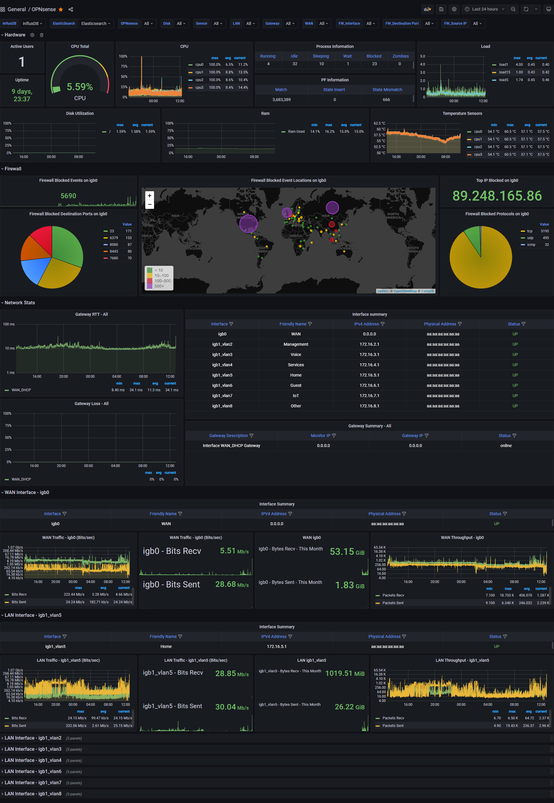

## What's Monitored
- Active Users
- Uptime
- CPU Load total
- Disk Utilization
- Memory Utilization
- CPU Utilization per core (Single Graph)
- Ram Utilization time graph
- Load Average
- Load Average Graph
- CPU and ACPI Temperature Sensors
- Gateway Response time - dpinger
- List of interfaces with IPv4, IPv6, Subnet, MAC, Status and pfSense labels thanks to [/u/trumee](https://www.reddit.com/r/PFSENSE/comments/fsss8r/additional_grafana_dashboard/fmal0t6/)
- WAN Statistics - Traffic & Throughput (Identified by dashboard variable)
- LAN Statistics - Traffic & Throughput (Identified by dashboard variable)

=======
## Changelog


Converted InfluxQL queries to Flux.


Converted pFSense functions to OPNsense.


Added Firewall graphs.



## Running on

    Grafana 8.2.4
    Influxdb 2.1.1
    Graylog 4.2

### docker-compose example with persistent storage
##### I've recently migrated my stack to Kubernetes, the image versions are updated but the docker-compose is untested.
```docker-compose

  grafana-pfSense:
    image: "grafana/grafana:7.4.3"
    container_name: grafana
    hostname: grafana
    mem_limit: 4gb
    ports:
      - "3000:3000"
    environment:
      TZ: "America/New_York"
      GF_INSTALL_PLUGINS: "grafana-clock-panel,grafana-simple-json-datasource,grafana-piechart-panel,grafana-worldmap-panel"
      GF_PATHS_DATA: "/var/lib/grafana"
      GF_DEFAULT_INSTANCE_NAME: "home"
      GF_ANALYTICS_REPORTING_ENABLED: "false"
      GF_SERVER_ENABLE_GZIP: "true"
      GF_SERVER_DOMAIN: "home.mydomain"
    volumes:
      - '/share/ContainerData/grafana:/var/lib/grafana'
    logging:
      driver: "json-file"
      options:
        max-size: "100M"
    network_mode: bridge

  influxdb-pfsense:
    image: "influxdb:1.8.3-alpine"
    container_name: influxdb
    hostname: influxdb
    mem_limit: 10gb
    ports:
      - "2003:2003"
      - "8086:8086"
    environment:
      TZ: "America/New_York"
      INFLUXDB_DATA_QUERY_LOG_ENABLED: "false"
      INFLUXDB_REPORTING_DISABLED: "true"
      INFLUXDB_HTTP_AUTH_ENABLED: "true"
      INFLUXDB_ADMIN_USER: "admin"
      INFLUXDB_ADMIN_PASSWORD: "adminpassword"
      INFLUXDB_USER: "pfsense"
      INFLUXDB_USER_PASSWORD: "pfsenseuserpassword"
      INFLUXDB_DB: "pfsense"
    volumes:
      - '/share/ContainerData/influxdb:/var/lib/influxdb'
    logging:
      driver: "json-file"
      options:
        max-size: "100M"
    network_mode: bridge
```


## Configuration

### Grafana
The Config for the dashboard relies on the variables defined within the dashboard in Grafana.  When importing the dashboard, make sure to select your datasource. 

Dashboard Settings -> Variables

WAN - $WAN is a static variable defined so that a separate dashboard panel can be created for WAN interfaces stats.  Use a comma-separated list for multiple WAN interfaces.

LAN - $LAN uses a regex to remove any interfaces you don't want to be grouped as LAN. The filtering happens in the "Regex" field. I use a negative lookahead regex to match the interfaces I want excluded.  It should be pretty easy to understand what you need to do here. I have excluded igb0 (WAN) and igb1,igb2,igb3 (only used to host vlans). 


### Telegraf
[Telegraf Config](config/additional_config.conf)

You must manually install Telegraf on OPNsense, as OPNsense does not currently support custom telegraf configuration.  To do so, SSH into your OPNsense router and type in:

`sudo pkg install telegraf`

In the [/config](config/additional_config.conf) directory you will find the telegraf config.

You will need to place this config in "/usr/local/etc/".


### Plugins
[Plugins](plugins)

**Plugins get copied to your OPNsense system**

Place the plugins in /usr/local/bin and set them to 555
   
## Troubleshooting

### Telegraf Plugins

- You can run most plugins from a shell/ssh session to verify the output. (the environment vars may be different when telegraf is executing the plugin)
- If you're copying from a windows system, make sure the [CRLF is correct](https://www.cyberciti.biz/faq/howto-unix-linux-convert-dos-newlines-cr-lf-unix-text-format/)
- The below command should display unix line endings (\n or LF) as $ and Windows line endings (\r\n or CRLF) as ^M$.

`# cat -e /usr/local/bin/telegraf_pfinterface.php`

#### Telegraf Troubleshooting
If you get no good output from running the plugin directly, try the following command before moving to the below step.

    # telegraf --test --config /usr/local/etc/telegraf.conf

To troubleshoot plugins further, add the following lines to the agent block in /usr/local/etc/telegraf.conf and send a HUP to the telegraf pid. You're going to need to do this from a ssh shell. One you update the config you are going to need to tell telegraf to read the new configs. If you restart telegraf from pfSense, this will not work since it will overwrite your changes.

#### Telegraf Config (Paste in to [agent] section)
    debug = true
    quiet = false
    logfile = "/var/log/telegraf/telegraf.log"

#### Restarting Telegraf
    # ps aux | grep '[t]elegraf.conf'
    # kill -HUP <pid of telegraf proces>

Now go read /var/log/telegraf/telegraf.log
    
### InfluxDB
When in doubt, run a few queries to see if the data you are looking for is being populated.

    bash-4.4# influx
    Connected to http://localhost:8086 version 1.8.3
    InfluxDB shell version: 1.8.3
    > auth
    username: admin
    password:
    > show databases
    name: databases
    name
    ----
    pfsense
    _internal
    > use pfsense
    Using database pfsense
    > show measurements
    name: measurements
    name
    ----
    cpu
    disk
    diskio
    gateways
    interface
    mem
    net
    netstat
    pf
    processes
    swap
    system
    tail_dnsbl_log
    tail_ip_block_log
    temperature
    > select * from system limit 20
    name: system
    time                host                     load1         load15        load5         n_cpus n_users uptime     uptime_format
    ----                ----                     -----         ------        -----         ------ ------- ------     -------------
    1585272640000000000 pfSense.home         0.0615234375  0.07861328125 0.0791015625  4      1       196870     2 days,  6:41
    1585272650000000000 pfSense.home         0.05126953125 0.07763671875 0.076171875   4      1       196880     2 days,  6:41
    1585272660000000000 pfSense.home         0.04296875    0.07666015625 0.0732421875  4      1       196890     2 days,  6:41
    1585272670000000000 pfSense.home         0.03564453125 0.07568359375 0.0703125     4      1       196900     2 days,  6:41
    1585272680000000000 pfSense.home         0.02978515625 0.07470703125 0.0673828125  4      1       196910     2 days,  6:41
    1585272690000000000 pfSense.home         0.02490234375 0.07373046875 0.064453125   4      1       196920     2 days,  6:42
    ...
    

How to drop influx v2 measurement

    bash-4.4# influx delete --bucket "$YourBucket" --predicate '_measurement="$Example"' -o $organization --start "1970-01-01T00:00:00Z" --stop "2050-12-31T23:59:00Z" --token "$YourAPIToken"
